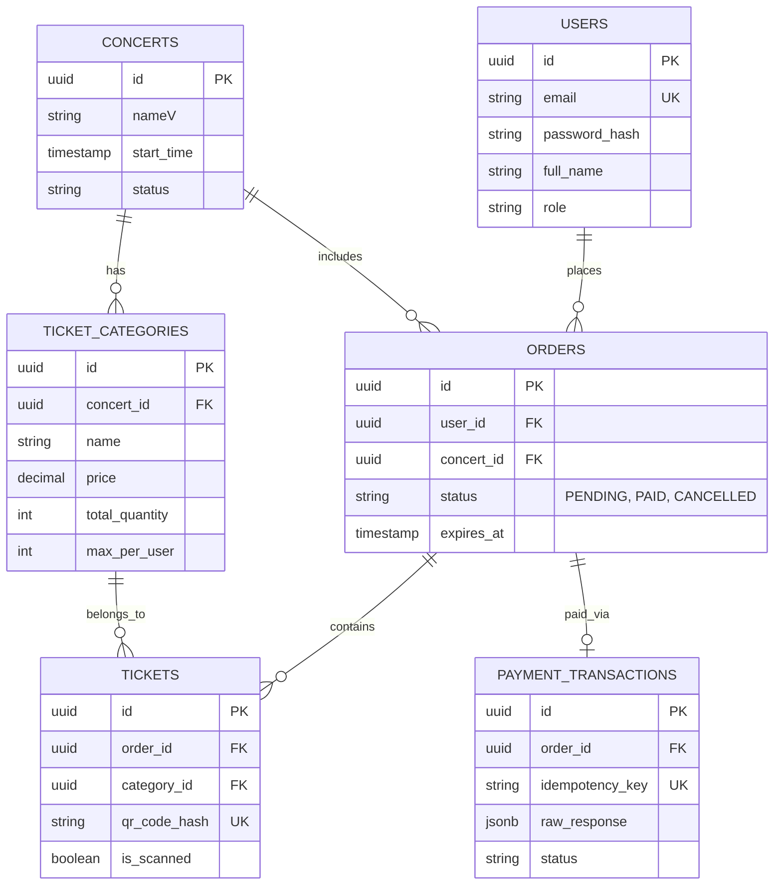

# TicketBox — Technical Design

## 1. Kiến trúc tổng thể

Hệ thống TicketBox được thiết kế theo kiến trúc **Modular Monolith (Nguyên khối chia module)** kết hợp với **Event-Driven Architecture (Kiến trúc hướng sự kiện)**.

* **Kiến trúc Modular Monolith:** Toàn bộ logic nghiệp vụ (Core Logic) được đóng gói và triển khai trên một ứng dụng Backend (Node.js/NestJS) duy nhất. Tuy nhiên, mã nguồn bên trong được phân tách ranh giới (strict boundaries) thành các module độc lập (Auth, Ticketing, Payment, Catalog). Điều này giúp tối ưu tốc độ phát triển, loại bỏ độ trễ mạng (network latency) giữa các service, nhưng vẫn giữ được khả năng bóc tách thành Microservices trong tương lai.
* **Kiến trúc Event-Driven:** Để giải quyết bài toán tải trọng cực đoan (80.000 users/5 phút), hệ thống không xử lý đồng bộ mọi thao tác ghi (Write). Thay vào đó, API Core chỉ tiếp nhận, "chốt đơn" nguyên tử trên RAM (Redis) và ném thông điệp (Event/Message) vào hệ thống Message Broker (RabbitMQ). Các Background Worker sẽ tiêu thụ hàng đợi này một cách tuần tự để ghi xuống Database vật lý.

### 1.1. Ranh giới module và trách nhiệm

Các module trong monolith được tách ranh giới rõ ràng bằng tầng domain service và repository riêng:

* **Auth & User:** Đăng ký, đăng nhập, JWT, quản lý role và permission.
* **Catalog:** Quản lý concert, sơ đồ chỗ ngồi, loại vé, cấu hình số lượng và giới hạn per-user.
* **Ticketing:** Giữ chỗ, phát hành e-ticket, quản lý trạng thái vé và chống overbooking.
* **Payment:** Tạo giao dịch, idempotency, xử lý webhook và trạng thái thanh toán.
* **Notification:** Gửi email/app, nhắc lịch, nhận event từ hệ thống.
* **Check-in:** Đồng bộ danh sách vé, ghi nhận quét QR, xử lý offline và bulk-sync.
* **Import & AI:** Nhập CSV khách mời, xử lý PDF, gọi LLM tóm tắt Artist Bio.

Các module giao tiếp bằng event nội bộ (in-process) và message qua RabbitMQ cho tác vụ bất đồng bộ: `TicketReserved`, `PaymentConfirmed`, `TicketIssued`, `CheckInSynced`, `GuestListImported`, `ArtistBioGenerated`.

## 2. C4 Diagram

### 2.1. Level 1 — System Context

Sơ đồ ngữ cảnh cấp 1 định vị TicketBox trong bức tranh toàn cảnh: các tác nhân (Actors) sử dụng hệ thống và các hệ thống ngoại vi (External Systems) mà TicketBox phụ thuộc.

---

### 2.2. Level 2 — Container

Sơ đồ cấp 2 "mở hộp" hệ thống TicketBox, thể hiện sự phân rã thành các khối hạ tầng (Containers) và Tech Stack cốt lõi được lựa chọn.

---

## 3. High-Level Architecture Diagram

Sơ đồ này đi sâu vào cách dữ liệu luân chuyển (Data Flow) để giải quyết bài toán tải cao và tích hợp bất đồng bộ.

---

## 4. Thiết kế Cơ sở dữ liệu

### 4.1. Lựa chọn Database và Trade-offs

Hệ thống chọn **PostgreSQL (Relational Database)** làm cơ sở dữ liệu chính thay vì các giải pháp NoSQL (như MongoDB).

* **Lý do:** Hệ thống bán vé là hệ thống liên quan trực tiếp đến tài chính và tính toàn vẹn dữ liệu. Bất kỳ sự bất đồng bộ (data anomaly) hay đọc ảo (phantom read) nào cũng dẫn đến thảm họa overbooking. PostgreSQL cung cấp chuẩn **ACID transaction** mạnh mẽ.
* **Đánh đổi:** PostgreSQL có giới hạn về connection pool và tốc độ ghi I/O disk so với NoSQL. Điểm yếu này được khắc phục bằng kiến trúc event-driven (dùng RabbitMQ làm hồ chứa để ghi từ từ).

### 4.2. Schema các Entity chính (ERD)

---

## 5. Thiết kế kiểm soát truy cập (Access Control)

Hệ thống áp dụng mô hình **RBAC (Role-Based Access Control)** kết hợp **Stateless JWT**.

* **Các nhóm người dùng:** Khán giả (chỉ xem/mua vé), Ban tổ chức (tạo sự kiện, xem thống kê), Nhân sự soát vé (chỉ dùng API đồng bộ/quét vé).
* **Cơ chế xác thực (JWT vs Stateful Session):**
* *Phương án Session:* Lưu session trên RAM/Redis. Nhược điểm: tốn RAM, mỗi request phải chọc vào Redis để xác thực, dễ nghẽn cổ chai.
* *Phương án JWT (được chọn):* Mã hóa trực tiếp thông tin `Role` và `Permissions` (vd: `CREATE_CONCERT`) vào payload của JWT.
* *Lợi ích dưới tải cao:* Tại tầng API Gateway/Middleware, hệ thống tự động giải mã chữ ký điện tử (Signature) bằng secret key trên RAM và kiểm tra chuỗi permission mà không cần truy vấn xuống Database hay Redis.
* *Trade-off:* JWT không thể thu hồi tức thì (revoke). Giải pháp: set TTL cho access token cực ngắn (15 phút) và dùng refresh token.

---

## 6. Thiết kế các cơ chế bảo vệ hệ thống

Đây là tầng phòng ngự (shields) thiết yếu để hệ thống sống sót qua "cơn bão" 80.000 users.

### 6.1. Kiểm soát tải đột biến (Traffic Spikes)

* **Vấn đề:** 80.000 khán giả cùng F5 trang và bấm nút "Mua vé" liên tục.
* **Giải pháp 1 (tầng mạng):** Triển khai thuật toán **Token Bucket** tại API Gateway. Thuật toán này cho phép hệ thống chịu được một đợt bùng nổ request ngắn hạn, nhưng drop các request vượt ngưỡng (vd: giới hạn mỗi IP 10 requests/giây). Hành vi khi vượt ngưỡng: trả về HTTP 429 (Too Many Requests).
* **Giải pháp 2 (chống overbooking - quan trọng nhất):** Tuyệt đối không dùng DB locking. Sử dụng **Redis Lua Script** để gom 3 lệnh (kiểm tra vé trống -> kiểm tra giới hạn vé của tài khoản -> trừ vé) thành 1 thao tác nguyên tử (atomic) chạy đơn luồng trên RAM. Giải quyết bài toán tranh chấp mà không bị race condition.

### 6.2. Xử lý cổng thanh toán không ổn định

* **Vấn đề:** Cổng VNPAY/MoMo có thể bị nghẽn, phản hồi mất 30 giây. Nếu backend đợi, thread pool sẽ cạn kiệt, kéo sập toàn bộ hệ thống.
* **Giải pháp:** Áp dụng **Circuit Breaker Pattern (cầu dao tự ngắt)**.
* **Trạng thái CLOSED:** Hoạt động bình thường, ghi nhận error rate.
* **Trạng thái OPEN:** Kích hoạt nếu tỷ lệ timeout > 50% trong 10 giây. Toàn bộ request thanh toán bị từ chối ngay lập tức (fast-fail) mà không cần chờ gửi mạng. Thread được giải phóng tức thì. Áp dụng graceful degradation, tự động ẩn nút VNPAY và báo bảo trì.
* **Trạng thái HALF-OPEN:** Sau 60 giây, cho phép 5 request đi qua thăm dò. Nếu thành công -> CLOSED, nếu lỗi -> OPEN lại.

### 6.3. Chống trừ tiền hai lần (Double Charging)

* **Vấn đề:** Khán giả mất kiên nhẫn bấm F5 hoặc bấm nút thanh toán nhiều lần. Khóa unique ở DB không có tác dụng ngay lập tức do độ trễ I/O.
* **Giải pháp:** Áp dụng **Idempotency Key (khóa lũy đẳng)**.
1. Frontend sinh mã UUID (Idempotency-Key) gắn vào header.
2. Backend dùng lệnh `SETNX` (Set if Not eXists) đẩy key vào Redis với TTL = 24h.
3. Nếu key chưa tồn tại: cho phép gọi sang VNPAY.
4. Nếu key đã tồn tại (khán giả bấm đúp): hệ thống chặn request ngay tại cửa, trả về kết quả giao dịch cũ, chặn đứng yêu cầu trừ tiền thứ hai.

### 6.4. Chiến lược Caching (Giải quyết Read-Heavy)

* **Các đối tượng cần cache:** Trang chủ, thông tin chi tiết sự kiện, số vé còn lại. Sơ đồ chỗ ngồi SVG cực nặng được đẩy ra mạng CDN (Cloudflare).
* **Chiến lược cho dữ liệu tĩnh (thông tin concert):** Dùng **Cache-Aside**. TTL cấu hình dài (24h). Invalidate chủ động (write-through) ngay khi admin cập nhật thông tin sự kiện.
* **Chiến lược cho dữ liệu động (số vé còn lại):** Không dùng cache-aside vì sẽ gây độ trễ hiển thị (stale data). Lưu số vé bằng một biến counter trong Redis. Biến này tự động giảm ngay khi Redis Lua Script chốt vé thành công, đảm bảo frontend luôn thấy số lượng tồn kho gần realtime.

---

## 7. Các quyết định kỹ thuật quan trọng (ADR)

### ADR 1: Thiết kế Cơ chế Check-in Offline (Split-Brain Problem)

* **Vấn đề:** Một vé giấy in ra hai bản, mang đến hai cổng từ đang mất mạng Internet để quét.
* **Lựa chọn:** Giải quyết bằng kỹ thuật (mesh network) vs giải quyết bằng nghiệp vụ (gate segregation).
* **Quyết định:** Chọn **Gate Segregation (phân luồng cổng)** kết hợp **Local SQLite**.
* **Trade-offs:** Thay vì thiết kế mạng nội bộ phức tạp, ta chia luồng: Gate 1 chỉ quét vé VIP, Gate 2 chỉ vé GA. Buổi sáng, thiết bị ở Gate 1 chỉ fetch danh sách QR hash của vé VIP vào SQLite. Nếu kẻ gian mang hai vé VIP đến Gate 1, SQLite đánh dấu `is_scanned = true` sau lần quét đầu và chặn lần hai. Nếu mang sang Gate 2, SQLite Gate 2 không có data -> báo vé giả. Khi mạng phục hồi, app tự động bulk-sync lên server.
* **Đồng bộ và xử lý xung đột:** Mỗi lần quét tạo một bản ghi `checkin_event_id`, kèm `ticket_id`, `gate_id`, `timestamp`. Server chấp nhận lần quét đầu tiên theo `ticket_id`, các lần sau bị từ chối và ghi audit log để truy vết.

### ADR 2: SQL Locking vs Redis Lua Script (Giải quyết Race Condition)

* **Lựa chọn 1: Pessimistic Locking (SELECT FOR UPDATE).** DB khóa row dữ liệu vé. Người 1 mua thì 79.999 người phải xếp hàng. **Trade-off:** Cạn kiệt connection pool, DB chết ngay lập tức dưới tải 80.000 requests.
* **Lựa chọn 2: Optimistic Locking (Versioning).** 80.000 người cùng đọc, nhưng chỉ 200 người ghi thành công. **Trade-off:** 79.800 người văng lỗi conflict. Trải nghiệm người dùng (UX) thảm họa.
* **Quyết định:** Chọn **Redis Lua Script + RabbitMQ**.
* **Tại sao:** Redis chạy single-threaded trên RAM. 80.000 requests được xếp hàng vi mô và xử lý nguyên tử với tốc độ nano giây. Redis trừ vé xong ném message vào RabbitMQ. PostgreSQL phía sau cứ thong thả lấy queue ra ghi đĩa (1000 record/s) mà không bao giờ bị nghẽn.

### ADR 3: RabbitMQ vs Kafka cho Message Broker

* **Vấn đề:** Chọn hệ thống điều phối thông điệp bất đồng bộ.
* **Quyết định:** Chọn **RabbitMQ**.
* **Lý do và đánh đổi:** Kafka chịu tải throughput cao hơn, nhưng overhead lớn và setup phức tạp cho tính năng hàng đợi trễ (delay message). Hệ thống TicketBox yêu cầu tính năng sống còn: "Nếu khán giả không thanh toán sau 10 phút, tự động nhả vé lại". RabbitMQ hỗ trợ native cơ chế **Dead Letter Exchange (DLX)** và **Delay Queue** phù hợp cho kịch bản hẹn giờ hủy đơn.

---

## 8. Bảo mật và vận hành

### 8.1. Bảo mật và chống lạm dụng

* **Rate limit đa tầng:** Theo IP, account và device fingerprint để giảm bot và spam.
* **Chống bot cơ bản:** Challenge theo hành vi (captcha mềm) khi phát hiện spike bất thường.
* **Bảo vệ dữ liệu QR:** Lưu `qr_code_hash` đã băm và salted, không lưu QR raw.
* **Quản lý secret:** Sử dụng biến môi trường và file cấu hình riêng cho local; không commit secret.
* **Audit log:** Lưu log giao dịch thanh toán, phát hành vé, check-in để truy vết.

### 8.2. Observability

* **Metrics:** Latency p95, error rate, queue depth, Redis Lua success rate, cache hit ratio.
* **Logging có traceId:** Mỗi request có `trace_id` xuyên suốt API -> MQ -> Worker.
* **Alerting:** Cảnh báo khi queue backlog > 10 phút, error rate > 1%, hoặc Redis failure tăng đột biến.