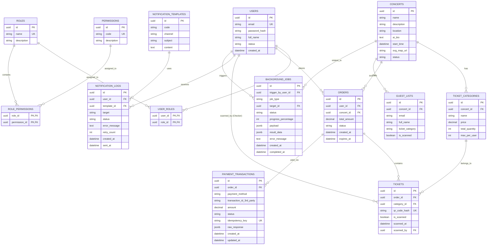

# TÀI LIỆU THIẾT KẾ CƠ SỞ DỮ LIỆU TỔNG THỂ (MASTER DB SCHEMA - V2)

## 1. SƠ ĐỒ THỰC THỂ LIÊN KẾT (OVERALL ERD)

---

## 2. ĐẶC TẢ CHI TIẾT CÁC BẢNG (DATA DICTIONARY)

Hệ thống sử dụng **PostgreSQL**. Tất cả các khóa chính (PK) đều sử dụng kiểu `UUID` để bảo mật và phân tán tốt trong môi trường Microservices/Modular Monolith.

### Module 1: Auth & RBAC (Quản trị và Phân quyền)

* **`users`**:
* `id` (UUID, PK)
* `email` (VARCHAR, Unique): Dùng để đăng nhập.
* `password_hash` (VARCHAR)
* `full_name` (VARCHAR): Họ và tên người dùng.
* `status` (VARCHAR): `ACTIVE`, `BANNED`.
* `created_at` (TIMESTAMP)

---

* **`roles`**: Định nghĩa nhóm quyền.
* `id` (UUID, PK)
* `name` (VARCHAR, Unique): Ví dụ `ADMIN`, `ORGANIZER`, `CHECKER`, `AUDIENCE`.
* `description` (VARCHAR)

---

* **`permissions`**: Quyền chi tiết (Sẽ được encode vào JWT).
* `id` (UUID, PK)
* `code` (VARCHAR, Unique): Ví dụ `CREATE_CONCERT`, `VIEW_REVENUE`, `SCAN_TICKET`.
* `description` (VARCHAR)

---

* **`user_roles`**: Bảng trung gian gán Role cho User (Khóa chính kép: `user_id`, `role_id`).
* **`role_permissions`**: Bảng trung gian gán Permission cho Role (Khóa chính kép: `role_id`, `permission_id`).

### Module 2: Catalog (Quản lý Concert)

* **`concerts`**:
* `id` (UUID, PK)
* `name` (VARCHAR)
* `description` (TEXT)
* `location` (VARCHAR)
* `ai_bio` (TEXT): Đoạn text giới thiệu nghệ sĩ do AI tạo ra.
* `start_time` (TIMESTAMP WITH TIME ZONE): Phục vụ gửi email nhắc nhở 24h.
* `svg_map_url` (VARCHAR): Link CDN trỏ tới sơ đồ ghế.
* `status` (VARCHAR): `DRAFT`, `PUBLISHED`, `COMPLETED`.

---

* **`ticket_categories`**:
* `id` (UUID, PK)
* `concert_id` (UUID, FK)
* `name` (VARCHAR): `SVIP`, `CAT1`, `GA`.
* `price` (DECIMAL)
* `total_quantity` (INT): Tổng cung.
* `max_per_user` (INT): Giới hạn số lượng vé được mua trên mỗi tài khoản.

---

### Module 3: Ticketing & Orders (Đặt vé & E-Ticket)

* **`orders`**:
* `id` (UUID, PK)
* `user_id` (UUID, FK)
* `concert_id` (UUID, FK)
* `total_amount` (DECIMAL)
* `status` (VARCHAR): `PENDING` (Đang giữ chỗ 10 phút), `PAID` (Thành công), `CANCELLED`.
* `created_at` (TIMESTAMP)
* `expires_at` (TIMESTAMP): RabbitMQ dựa vào cột này để release vé nếu user không thanh toán.

---

* **`tickets`**: Kho chứa vé điện tử.
* `id` (UUID, PK)
* `order_id` (UUID, FK, Cascade Delete)
* `category_id` (UUID, FK)
* `qr_code_hash` (VARCHAR, Unique): Mã băm SHA-256 sinh ra sau khi trả tiền xong.
* `is_scanned` (BOOLEAN): Mặc định `FALSE`.
* `scanned_at` (TIMESTAMP): Thời gian thực tế khi vé được quét tại cổng.
* `scanned_by` (UUID, FK): ID của nhân viên (Checker) thực hiện quét vé.

---

### Module 4: Payments (Thanh toán)

* **`payment_transactions`**:
* `id` (UUID, PK)
* `order_id` (UUID, FK)
* `payment_method` (VARCHAR): `VNPAY`, `MOMO`.
* `transaction_id_3rd_party` (VARCHAR): Mã giao dịch trả về từ hệ thống đối tác.
* `amount` (DECIMAL): Số tiền giao dịch.
* `status` (VARCHAR): `INIT`, `SUCCESS`, `FAILED`.
* `idempotency_key` (VARCHAR, Unique): Mã UUID do Frontend gửi lên để chặn trừ tiền 2 lần.
* `raw_response` (JSONB): Chuỗi JSON VNPAY trả về để đối soát.
* `created_at` (TIMESTAMP)
* `updated_at` (TIMESTAMP)

---

### Module 5: Integrations & Async Tasks

* **`guest_lists`**: Danh sách VIP từ file CSV.
* `id` (UUID, PK)
* `concert_id` (UUID, FK)
* `email` (VARCHAR)
* `full_name` (VARCHAR)
* `ticket_category` (VARCHAR): Ghi chú loại khách mời (VIP/GUEST).
* `is_scanned` (BOOLEAN): Thống nhất tên biến với bảng Tickets.
* **UNIQUE CONSTRAINT** `(concert_id, email)`: Dùng cho truy vấn `UPSERT` khi đọc CSV.

---

* **`background_jobs`**: Theo dõi tác vụ nền.
* `id` (UUID, PK)
* `trigger_by_user_id` (UUID, FK): Ai là người tải file lên để chạy Job.
* `job_type` (VARCHAR): `AI_PDF_OCR`, `CSV_IMPORT`.
* `target_id` (UUID, FK): ID của Concert tương ứng.
* `status` (VARCHAR): `PENDING`, `PROCESSING`, `COMPLETED`, `FAILED`.
* `progress_percentage` (INT): Phục vụ thanh Loading Bar trên giao diện.
* `payload` (JSONB): Thông tin cấu hình/đường dẫn file S3.
* `result_data` (JSONB): Kết quả đầu ra (Ví dụ đoạn text AI Bio).
* `error_message` (TEXT): Log lỗi nếu Job sập.
* `created_at` (TIMESTAMP)
* `completed_at` (TIMESTAMP)

---

### Module 6: Notifications (Thông báo tự động)

* **`notification_templates`**:
* `id` (UUID, PK)
* `code` (VARCHAR): `ORDER_SUCCESS`, `CONCERT_REMINDER_24H`.
* `channel` (VARCHAR): `EMAIL`, `ZALO`, `SMS`.
* `subject` (VARCHAR)
* `content` (TEXT): Chứa text có biến số (Ví dụ: `Xin chào {{name}}...`).

---

* **`notification_logs`**:
* `id` (UUID, PK)
* `user_id` (UUID, FK)
* `template_id` (UUID, FK)
* `target` (VARCHAR): Đích đến thực tế (Địa chỉ email/Số điện thoại).
* `status` (VARCHAR): `PENDING`, `SENT`, `FAILED`.
* `error_message` (TEXT)
* `retry_count` (INT): Số lần gửi lại nếu API bên thứ 3 lỗi.
* `created_at` (TIMESTAMP)
* `sent_at` (TIMESTAMP)