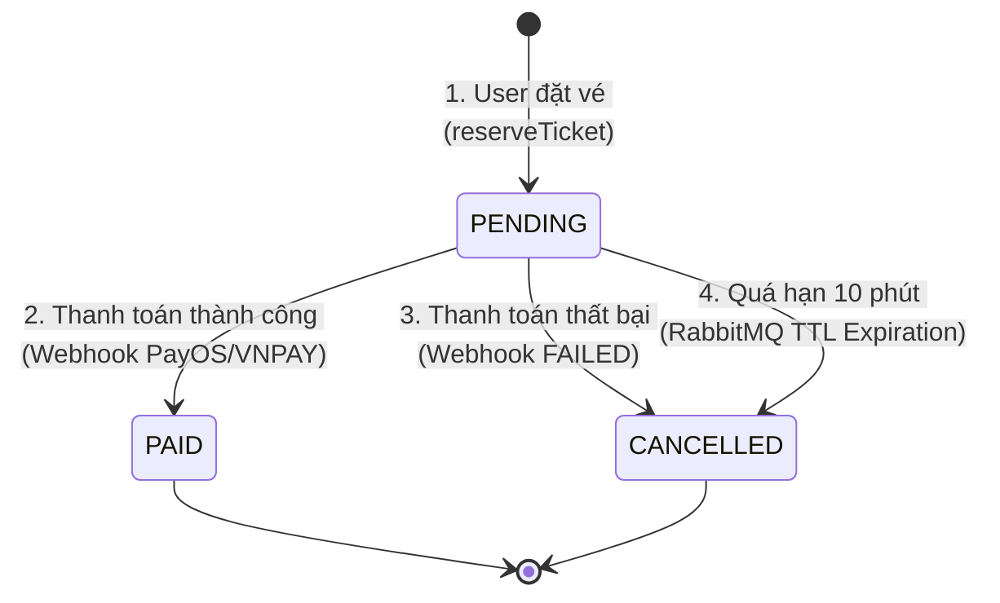

# Payment & Ticketing Integration Guide

Tài liệu này hướng dẫn chi tiết cách tích hợp nghiệp vụ giữa module **Payment** và module **Ticketing** nhằm đảm bảo tính nhất quán dữ liệu giữa PostgreSQL DB và Redis Cache trong các kịch bản thanh toán.

---

## 1. Luồng nghiệp vụ tổng quan (Concert Ticket Lifecycle)

Vòng đời của một đơn đặt vé đi qua các trạng thái sau:



1. **Khởi tạo (PENDING):** Trừ vé thành công trên Redis ➜ Gửi message qua RabbitMQ ➜ Lưu `Order` ở trạng thái `PENDING` trong DB. Lúc này **chưa tạo dòng dữ liệu trong bảng `Ticket`** (chưa sinh QR Code).
2. **Thanh toán thành công (PAID):** Webhook từ cổng thanh toán báo thành công ➜ Cập nhật `Order` thành `PAID` ➜ Tạo các bản ghi `Ticket` tương ứng trong DB.
3. **Thanh toán thất bại/Hủy (CANCELLED):** Webhook báo thất bại hoặc người dùng chủ động hủy thanh toán ➜ Cập nhật `Order` thành `CANCELLED` ➜ **Cộng trả lại vé trên Redis**.
4. **Hết hạn thanh toán (Auto-Expiration):** Sau 10 phút nếu đơn hàng vẫn là `PENDING` ➜ RabbitMQ kích hoạt Consumer chuyển trạng thái sang `CANCELLED` và tự động cộng trả vé trên Redis.

---

## 2. Hướng dẫn dành cho nhóm Phát triển Payment

### 2.1. Đọc thông tin vé khi hiển thị màn hình thanh toán
Khi người dùng bấm vào link thanh toán hoặc hiển thị thông tin hóa đơn, bạn có thể lấy thông tin khu vực vé và số lượng trực tiếp từ cột JSON `ticket_metadata` của bảng [Order](file:///d:/Year3_Semester2/ThietKePhanMem/Project/Ticket_Box/prisma/schema.prisma#L105):
```json
{
  "category_id": "uuid-hạng-vé",
  "category_name": "GA Zone A",
  "quantity": 2,
  "unit_price": 500000
}
```

### 2.2. Xử lý khi thanh toán THÀNH CÔNG
Khi nhận được webhook xác nhận thanh toán thành công từ cổng thanh toán (PayOS, VNPAY...):
* **Hành động 1:** Cập nhật trạng thái `status: 'PAID'` cho bản ghi `Order`.
* **Hành động 2:** Tạo các bản ghi vé thực tế trong bảng [Ticket](file:///d:/Year3_Semester2/ThietKePhanMem/Project/Ticket_Box/prisma/schema.prisma#L123) để khách hàng có thể quét mã check-in.

*Đoạn code mẫu trong giao dịch DB (Prisma Transaction):*
```typescript
await this.prisma.$transaction(async (tx) => {
    // 1. Cập nhật trạng thái đơn hàng sang PAID
    await tx.order.update({
        where: { id: orderId },
        data: { status: 'PAID' },
    });

    // 2. Tạo bản ghi vé vật lý kèm mã QR hash
    const breakdown = [ { category_id: metadata.category_id, quantity: metadata.quantity } ];
    for (const item of breakdown) {
        for (let index = 0; index < item.quantity; index += 1) {
            const qrCodeHash = this.generateQrCodeHash(orderId, transactionId, item.category_id, index);
            await tx.ticket.create({
                data: {
                    order_id: orderId,
                    category_id: item.category_id,
                    qr_code_hash: qrCodeHash,
                },
            });
        }
    }
});
```

### 2.3. Xử lý khi thanh toán THẤT BẠI hoặc HỦY
Khi cổng thanh toán báo giao dịch thất bại hoặc người dùng chủ động click nút "Hủy thanh toán":
* **Hành động 1:** Cập nhật trạng thái `status: 'CANCELLED'` cho bản ghi `Order`.
* **Hành động 2 (QUAN TRỌNG):** Bạn phải **gọi hàm hoàn trả tồn kho vé trên Redis ngay lập tức** để giải phóng chỗ cho người khác mua. Nếu không hoàn trả, vé sẽ bị khóa oan trên Redis cho đến khi hết hạn 10 phút.

*Đoạn code mẫu xử lý:*
```typescript
import { TicketingService } from '../../ticketing/services/ticketing.service';

// Trong PaymentService:
constructor(
    private readonly prisma: PrismaService,
    private readonly ticketingService: TicketingService // Inject TicketingService
) {}

async handlePaymentFailed(orderId: string) {
    const order = await this.prisma.order.findUnique({ where: { id: orderId } });
    if (!order || order.status !== 'PENDING') return;

    await this.prisma.order.update({
        where: { id: orderId },
        data: { status: 'CANCELLED' },
    });

    // Giải phóng tồn kho trên Redis ngay lập tức
    const metadata = order.ticket_metadata as any;
    await this.ticketingService.rollbackCategoryInventory(
        order.user_id,
        metadata.category_id,
        metadata.quantity
    );
}
```

---

## 3. Cơ chế phòng thủ tự động (Safety Net)

Nếu người dùng tắt trình duyệt và không thanh toán cũng như không hủy đơn hàng:
* Hàng đợi **RabbitMQ (order.expired.queue)** sẽ tự động bắt được sự kiện hết hạn sau 10 phút.
* Consumer [OrderExpiredConsumer](file:///d:/Year3_Semester2/ThietKePhanMem/Project/Ticket_Box/apps/backend-api/src/modules/ticketing/consumers/order.consumer.ts#L82) sẽ kiểm tra trạng thái đơn hàng. 
* Nếu đơn hàng vẫn ở trạng thái `PENDING`, consumer sẽ tự động chuyển trạng thái đơn sang `CANCELLED` và hoàn vé trên Redis.
* Nếu đơn hàng đã được cập nhật thành `PAID` hoặc `CANCELLED` trước đó từ phía Payment, consumer sẽ tự động bỏ qua (idempotency check), đảm bảo không hoàn vé hai lần.
