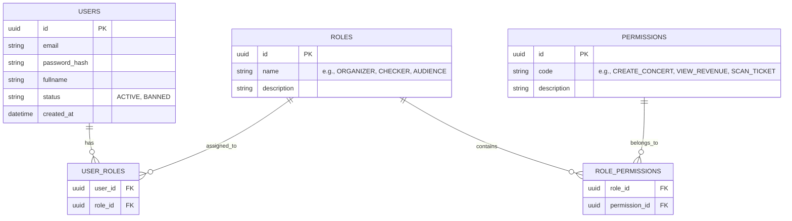
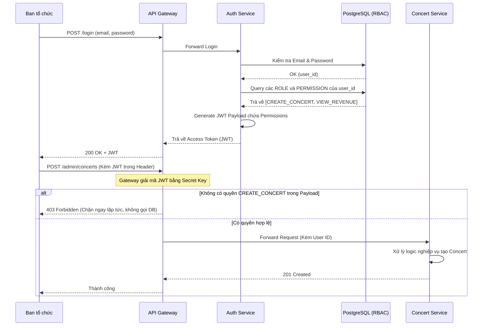

# 4. QUẢN TRỊ VÀ KIỂM SOÁT TRUY CẬP (ADMIN & RBAC)

Hệ thống TicketBox không chỉ phục vụ khán giả mà còn là công cụ nghiệp vụ cốt lõi của Ban tổ chức và Nhân sự kiểm soát. Yêu cầu đặt ra là phải kiểm soát truy cập chặt chẽ nhưng không làm suy giảm hiệu năng của hệ thống dưới tải cao.

## 1. TỔNG QUAN

Hệ thống xác định 3 nhóm người dùng (Roles) chính với quyền hạn khác biệt:

* **Khán giả:** Chỉ xem thông tin và mua vé.
* **Ban tổ chức:** Dùng trang web admin để tạo, sửa, hủy concert, cấu hình loại vé và xem thống kê doanh thu.
* **Nhân sự soát vé:** Chỉ có quyền truy cập chức năng quét mã QR.

### Giải pháp kỹ thuật:

* **Mô hình (RBAC):** Role-Based Access Control.
* **Bảng DB:** `Users`, `Roles`, `Permissions`, và bảng trung gian `User_Roles`, `Role_Permissions`.
* **Stack:** JSON Web Token (JWT).
* **Cơ chế:** Khi login, mã hóa Role/Permissions vào payload của JWT. Tại API Gateway hoặc Middleware, kiểm tra token. Yêu cầu API `/admin/concerts` phải có permission `Edit_Concert`. Cách này giúp không phải query DB liên tục để check quyền.

---

# DETAILS: CHUYÊN SÂU LUỒNG QUẢN TRỊ VÀ KIỂM SOÁT TRUY CẬP

## A. BÀI TOÁN 1: KIỂM SOÁT QUYỀN HẠN PHỨC TẠP (ACCESS CONTROL)

Theo yêu cầu nghiệp vụ, trang admin chỉ dành cho nội bộ và có ba nhóm người dùng với quyền hạn hoàn toàn khác biệt.

### 1. Phân tích các phương án thiết kế kiến trúc phân quyền

* **Phương án 1: Hardcode Role (Kiểm tra cứng trong code).** Code logic dạng `if (user.role == 'Organizer')`.
* *Tại sao loại bỏ:* Rất thiếu linh hoạt. Nếu tương lai Ban tổ chức muốn tách thêm vai trò "Kế toán" (chỉ được xem doanh thu, không được sửa concert), developer bắt buộc phải sửa code và deploy lại toàn bộ hệ thống.

* **Phương án 2: Mô hình RBAC (Role-Based Access Control) - Đề xuất chọn.**
* *Cách hoạt động:* Quyền (Permission) được gán cho Vai trò (Role). Vai trò được gán cho Người dùng (User).
* *Điểm ưu việt:* Tính linh hoạt tuyệt đối. Admin có thể tạo ra các Role mới (như "Kế toán", "Hỗ trợ khách hàng") và gán Permission cho họ thông qua giao diện quản trị (UI) mà hệ thống không cần thay đổi một dòng code nào.

## B. BÀI TOÁN 2: HIỆU NĂNG XÁC THỰC (AUTHENTICATION BOTTLENECK)

Khi có 80.000 khán giả truy cập, mỗi API request gửi lên đều cần xác định xem: "Người này là ai? Có bị khóa tài khoản không? Có quyền gọi API này không?". Nếu mỗi request đều phải chọc vào Database để kiểm tra, Database sẽ sập ngay lập tức trước khi kịp xử lý logic mua vé.

### Thiết kế được chọn: Stateless JWT (JSON Web Token) kết hợp API Gateway

* **Tại sao là JWT?** Token này chứa một `payload` (gói dữ liệu) mang theo thông tin ID, Role và danh sách các Permissions của user. Payload này được ký điện tử (Digital Signature) bằng một khóa bí mật (Secret Key) trên server, không ai có thể giả mạo.
* **Cách giải quyết tải trọng:** Khi người dùng gọi API, **API Gateway** sẽ tự động giải mã JWT, đọc danh sách Permission ngay trên bộ nhớ (RAM) và kiểm tra. Ví dụ: Request gọi vào `/api/admin/concerts` sẽ bị API Gateway chặn lại ngay lập tức nếu trong JWT không có chữ `Edit_Concert`. Database hoàn toàn không bị làm phiền trong khâu này.
* **Trade-off (Sự đánh đổi):** JWT không thể thu hồi (revoke) ngay lập tức trước khi nó hết hạn. Nếu Ban tổ chức đuổi việc một nhân sự soát vé, token của người đó vẫn còn hiệu lực trong vài giờ.
* **Cách khắc phục Trade-off:** Set thời gian sống (TTL - Time to Live) của Access Token rất ngắn (ví dụ 15 phút), và sử dụng Refresh Token (lưu ở Redis) để cấp lại token mới. Khi đuổi việc nhân sự, chỉ cần xóa Refresh Token trong Redis.

---

## C. THIẾT KẾ CƠ SỞ DỮ LIỆU & LUỒNG XỬ LÝ (ERD & DATA FLOW)

Mô hình dữ liệu dưới đây tuân thủ chuẩn RBAC, đảm bảo sự tách biệt rạch ròi giữa người dùng và quyền hạn.

### 1. Sơ đồ thực thể liên kết (ERD) - RBAC Module

**Ý đồ thiết kế:**

* **Bảng trung gian `USER_ROLES`:** Hỗ trợ trường hợp một User có thể kiêm nhiệm nhiều Role (ví dụ: Vừa là Admin hệ thống, vừa là Organizer của một sự kiện cụ thể).
* **`PERMISSIONS.code`:** Đây chính là các chuỗi string (như `CREATE_CONCERT`) sẽ được đóng gói (encode) vào bên trong JWT Payload để API Gateway đọc.

### 2. Sơ đồ luồng hoạt động (Sequence Diagram)

Sơ đồ dưới đây mô tả cách API Gateway đứng ra làm "bảo vệ", che chắn cho Core Services và Database khỏi các request không hợp lệ hoặc thiếu quyền.

