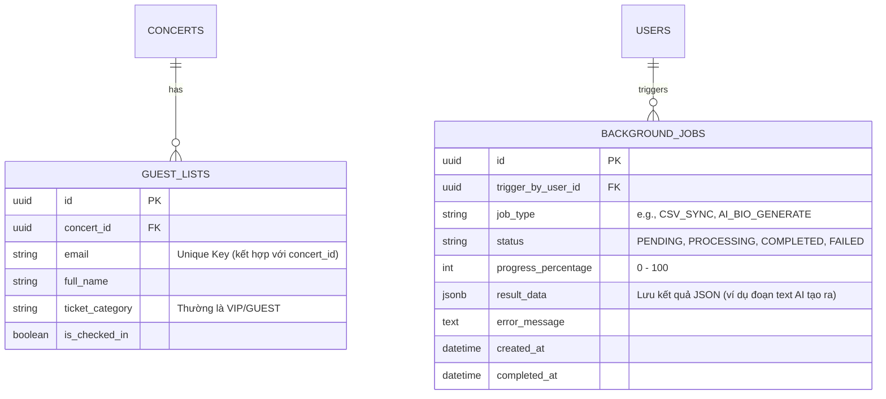
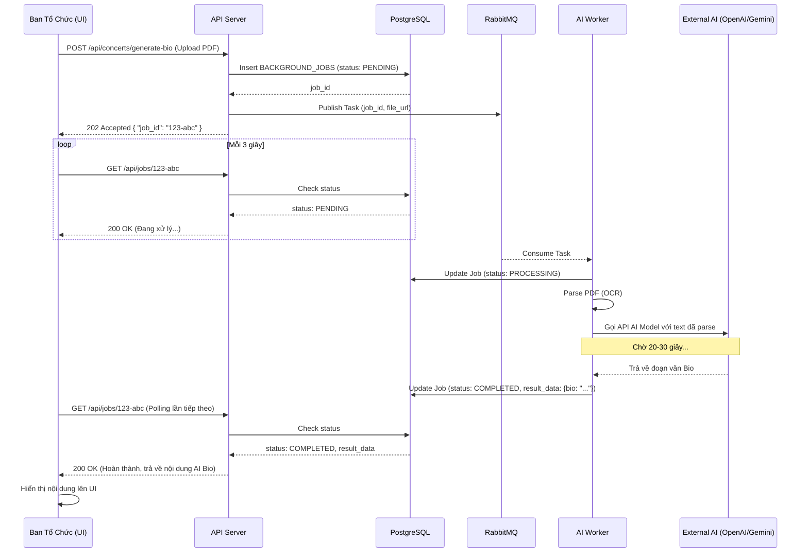

## 6. ĐỒNG BỘ DỮ LIỆU & TÍCH HỢP NGOÀI

Các tính năng như tải PDF tạo AI bio và đọc file CSV khách mời.

### Giải pháp kỹ thuật:

- Đồng bộ CSV khách mời (Tích hợp 1 chiều): \* Dùng Cronjob đọc file định kỳ.

- Để không block main thread và không chết khi file quá lớn: Đọc file -> Validate -> Cắt nhỏ (Chunking) thành từng batch (ví dụ 500 dòng/batch) -> Đẩy vào Queue.
- Worker lấy từng batch ghi vào DB bằng lệnh **Upsert** (`INSERT ... ON CONFLICT DO UPDATE` trong PostgreSQL) để tránh lỗi trùng lặp dữ liệu mà không cần xóa dữ liệu cũ.

- AI Artist Bio: Quá trình OCR PDF và gọi LLM API mất nhiều thời gian (vài chục giây). Bắt buộc phải xử lý bất đồng bộ qua Message Queue. Ban tổ chức upload file -> Trả về ID Job -> Frontend dùng Long-polling hoặc WebSocket đợi kết quả trả về từ AI.

# DETAILS: CHUYÊN SÂU ĐỒNG BỘ DỮ LIỆU & TÍCH HỢP NGOÀI

Module này chịu trách nhiệm xử lý các tác vụ "nặng" ở chế độ chạy ngầm (Background Processing), đảm bảo ứng dụng chính luôn phản hồi nhanh chóng và không bị block (nghẽn) bởi các đối tác bên thứ ba.

## A. BÀI TOÁN 1: ĐỒNG BỘ CSV KHÁCH MỜI (BULK DATA PROCESSING)

Hệ thống quản lý khách mời của nhãn hàng không cung cấp API mở, cách duy nhất là nhận file CSV theo lịch cố định. Luồng nhập dữ liệu bắt buộc phải giải quyết được vấn đề file lỗi, dữ liệu trùng lặp và tuyệt đối không được làm gián đoạn (block) hệ thống TicketBox đang vận hành.

### 1. Phân tích sự cố nếu xử lý đồng bộ (Synchronous Processing)

- **Cách làm ngây thơ (Naive approach):** Viết một vòng lặp `for` đọc từng dòng của file CSV (ví dụ: 10.000 dòng) và gọi lệnh `INSERT` vào database.
- **Hậu quả:** API sẽ bị treo (Timeout) vì quá thời gian phản hồi (thường Gateway giới hạn 30s-60s). Hơn nữa, nếu dòng thứ 9.999 bị lỗi, hệ thống văng Exception, toàn bộ quá trình rollback, bạn sẽ không biết file đã chạy được đến đâu.

### 2. Thiết kế được chọn: Chunking + Message Queue + Upsert

- **Cơ chế Cắt nhỏ (Chunking) & Hàng đợi:**
- Dùng Cronjob hoặc Admin upload để bắt đầu đọc file định kỳ.

- Chỉ đọc file vào RAM, kiểm tra tính hợp lệ sơ bộ (Validate).
- Cắt nhỏ file ra thành từng mảng (batch), ví dụ 500 dòng/batch.

- Đóng gói mỗi batch thành một message và ném vào RabbitMQ. Nhờ vậy, tiến trình gọi API/Cronjob kết thúc ngay lập tức, giải phóng bộ nhớ.

- **Worker & Upsert Constraint:**
- Background Worker sẽ từ từ lấy từng batch ra xử lý.
- Để xử lý tình huống "dữ liệu trùng", worker không dùng lệnh `INSERT` thông thường, mà sử dụng cú pháp **Upsert** (`INSERT ... ON CONFLICT DO UPDATE` trong PostgreSQL).

- _Ưu điểm:_ Nếu khách mời đã tồn tại trong DB, nó sẽ tự động update thông tin mới. Nếu chưa có, nó sẽ tạo mới. Đảm bảo tính nhất quán dữ liệu mà không cần phải query kiểm tra tồn tại (tiết kiệm 1 nửa số query) và không cần xóa dữ liệu cũ.

---

## B. BÀI TOÁN 2: AI ARTIST BIO (LONG-RUNNING TASKS)

Ban tổ chức có thể tải lên file PDF hồ sơ nghệ sĩ hoặc press kit của concert. Hệ thống tự động xử lý, tách nội dung, làm sạch văn bản và gửi sang mô hình AI để tạo bản giới thiệu ngắn gọn.

### 1. Phân tích nút thắt cổ chai (Bottleneck)

Việc đọc file PDF (OCR) và chờ phản hồi từ LLM API (như OpenAI, Gemini) là các thao tác I/O cực kỳ chậm, có thể mất từ vài chục giây đến vài phút. Bắt buộc phải xử lý bất đồng bộ qua Message Queue.

### 2. Thiết kế được chọn: Asynchronous Job + Polling / WebSocket

Mô hình chuẩn để giải quyết UX (trải nghiệm người dùng) cho các tác vụ lâu.

- **Quy trình Request:**

1. Ban tổ chức upload PDF qua Frontend.
2. Backend lưu file vào S3 (hoặc local storage), tạo một bản ghi trạng thái `PENDING` trong database và trả ngay về một `job_id` cho Frontend.

3. Đồng thời, đẩy một message chứa `job_id` và URL file vào RabbitMQ.

- **Quy trình Xử lý & Phản hồi:**

1. AI Worker nhặt message, thực hiện OCR, gọi LLM, nhận kết quả và lưu vào DB. Sau đó đổi trạng thái Job thành `COMPLETED`.
2. Ở phía Frontend, ngay khi nhận được `job_id`, nó sẽ hiển thị thanh loading và dùng **Long-polling** (gọi API 3 giây/lần) hoặc kết nối **WebSocket** để lắng nghe trạng thái của Job. Khi báo `COMPLETED`, UI tự động hiển thị đoạn text AI vừa viết.

---

## C. THIẾT KẾ CƠ SỞ DỮ LIỆU & LUỒNG XỬ LÝ (ERD & DATA FLOW)

Để hỗ trợ xử lý nền (Background processing) một cách mượt mà và dễ dàng tra cứu lỗi (troubleshoot), chúng ta cần thiết kế bảng theo dõi tiến trình.

### 1. Sơ đồ thực thể liên kết (ERD) - Integration & Background Jobs

**Ý đồ thiết kế:**

- **Bảng `GUEST_LISTS`:** Tách biệt với bảng vé thông thường (`TICKETS`) vì khách mời thường không có giao dịch tài chính (`ORDERS`). Cột `email` và `concert_id` tạo thành một **Composite Unique Constraint** để phục vụ lệnh Upsert khi có khách bị trùng.
- **Bảng `BACKGROUND_JOBS`:** Đóng vai trò là trung tâm kiểm soát tác vụ. Bất kỳ tác vụ nào mất trên 3 giây đều nên lưu vào đây. Nó cho phép Admin xem lại lịch sử ("Tại sao file PDF này tạo bio thất bại?") và cung cấp dữ liệu cho thanh tiến trình (progress bar) trên giao diện.

### 2. Sơ đồ luồng hoạt động (Sequence Diagram) - Luồng tạo AI Bio bất đồng bộ

Sơ đồ này mô tả pattern kinh điển "Async Request-Reply", giúp hệ thống không bao giờ bị nghẽn (block) kết nối HTTP.

