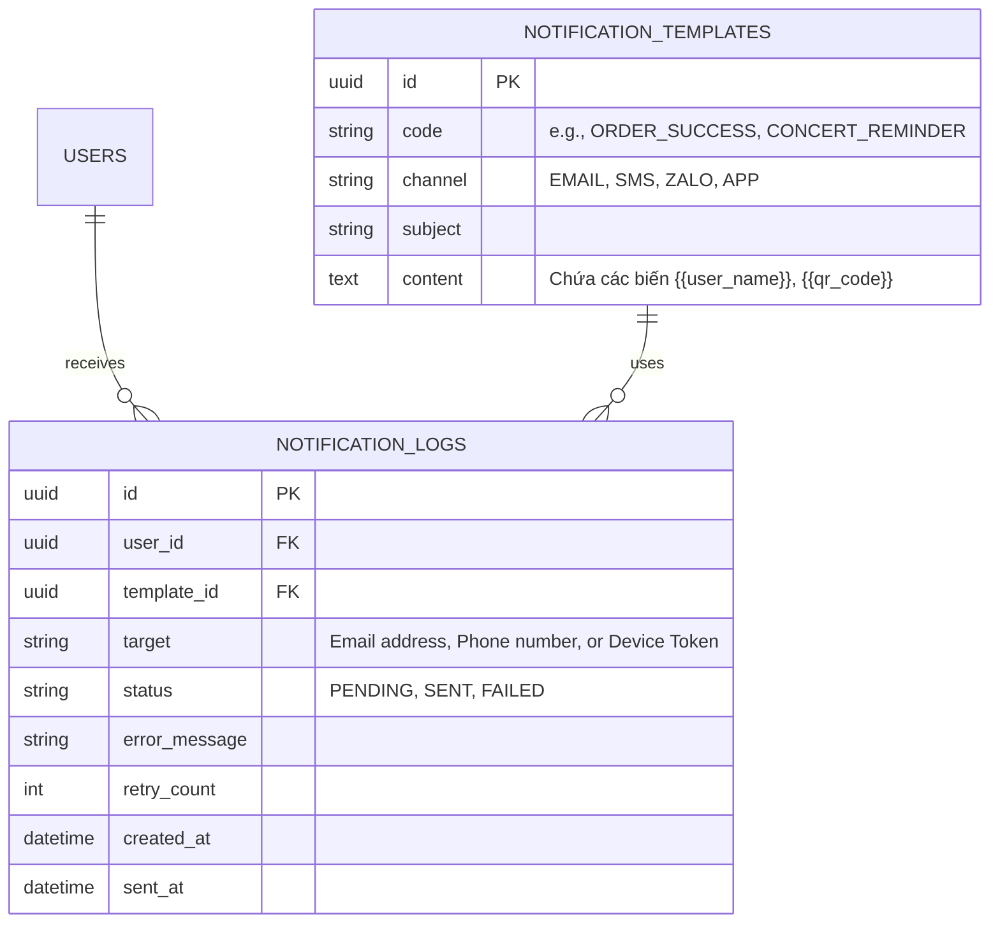
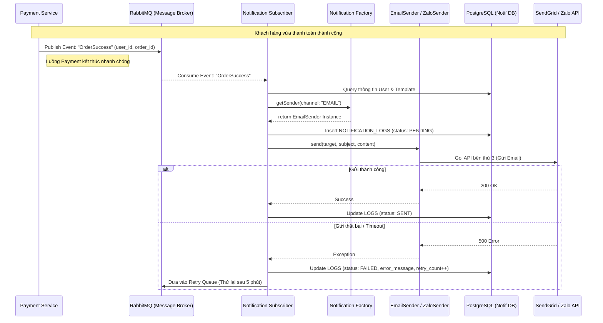

## 3. THÔNG BÁO (NOTIFICATIONS)

Hệ thống cần gửi email, app notification và mở rộng sang Zalo, SMS trong tương lai.

### Giải pháp kỹ thuật:

- **Design Pattern:** Sử dụng **Strategy Pattern** và **Factory Pattern**. Định nghĩa interface `INotificationSender`. Các class thực thi: `EmailSender`, `ZaloSender`, `SMSSender`. Khi cần thêm kênh mới, chỉ cần viết thêm class mà không sửa core logic.

- **Kiến trúc:** Sử dụng **Pub/Sub**. Ticketing Service bắn ra event `OrderSuccess`. Notification Service lắng nghe event này để gửi thông báo.
- Nhắc nhở tự động 24h: Sử dụng Cronjob (Quartz, Celery) quét database mỗi giờ để tìm concert sắp diễn ra; hoặc dùng tính năng **Delay Message/Dead Letter Queue** của RabbitMQ (hẹn giờ message sau X ngày mới đẩy vào queue).

---

# DETAILS: CHUYÊN SÂU LUỒNG THÔNG BÁO (NOTIFICATION MODULE)

Module này đóng vai trò giao tiếp trực tiếp với khán giả. Yêu cầu cốt lõi là tính mở rộng (không phải đập đi xây lại khi thêm kênh mới) và tính bất đồng bộ (không làm chậm luồng mua vé chính).

## A. BÀI TOÁN 1: MỞ RỘNG KÊNH THÔNG BÁO (EXTENSIBILITY)

Sau khi mua vé thành công, khán giả nhận thông báo xác nhận qua app và email kèm e-ticket. Tuy nhiên, hệ thống cần được thiết kế để dễ dàng bổ sung kênh thông báo mới (ví dụ: Zalo OA, SMS) trong tương lai mà không cần thay đổi lớn.

### 1. Phân tích vấn đề ở tầng Code (Code-level)

Nếu developer code theo kiểu "cứng" (Hardcode) với các câu lệnh `if/else` (ví dụ: `if (channel == 'EMAIL') sendEmail() else if (channel == 'ZALO') sendZalo()`), thì mỗi lần thêm kênh mới, file code lõi sẽ bị phình to, dễ sinh bug và vi phạm nguyên lý Open/Closed Principle (OCP) trong SOLID.

### 2. Thiết kế được chọn: Strategy Pattern + Factory Pattern

Sử dụng Strategy Pattern và Factory Pattern là phương án hoàn hảo để giải quyết bài toán này ở tầng ứng dụng.

- **Cơ chế hoạt động:**
- Định nghĩa interface `INotificationSender`. Các class thực thi: `EmailSender`, `ZaloSender`, `SMSSender`.

- Tạo một `NotificationFactory` để quyết định xem sự kiện này nên khởi tạo class nào dựa vào cấu hình của User hoặc Ban tổ chức.

- **Điểm ưu việt:** Khi cần thêm kênh mới, chỉ cần viết thêm class mà không sửa core logic. Hệ thống hoàn toàn decoupling (giảm độ kết dính).

### 3. Kiến trúc hệ thống: Mô hình Pub/Sub (Publish/Subscribe)

Không được phép gọi hàm `SendEmail()` trực tiếp trong API Thanh toán. Gửi email mất từ 1-3 giây, nếu 80.000 người mua vé cùng lúc sẽ làm sập API.

- **Cách giải quyết:** Ticketing Service bắn ra event `OrderSuccess`. Lúc này luồng mua vé kết thúc ngay lập tức và trả kết quả về cho user (tốc độ mili-giây).

- Notification Service lắng nghe event này để gửi thông báo. Dịch vụ này chạy độc lập, lấy từng event ra xử lý từ từ (tốc độ tùy thuộc vào giới hạn API của bên gửi mail/Zalo).

---

## B. BÀI TOÁN 2: NHẮC NHỞ TỰ ĐỘNG (AUTOMATED REMINDERS)

Khi concert sắp diễn ra (trước 24 giờ), hệ thống gửi nhắc nhở tự động.

### Đánh giá phương án & Trade-offs:

- **Phương án 1: Delay Message / Dead Letter Queue (DLQ) của RabbitMQ**
- _Cách hoạt động:_ Ngay khi user mua vé, ta dùng tính năng Delay Message/Dead Letter Queue của RabbitMQ (hẹn giờ message sau X ngày mới đẩy vào queue). Ví dụ: Concert diễn ra ngày 20/11, user mua vé ngày 01/10. Hệ thống ném 1 message vào queue với TTL là 49 ngày.

- _Trade-off:_ Cách này thuần Event-driven, rất mượt. Nhưng nhược điểm chí mạng là RabbitMQ phải lưu giữ hàng trăm nghìn message rác trên RAM/Disk trong nhiều tháng. Quản lý trạng thái cực kỳ khó (như nếu concert bị dời ngày, ta phải tìm cách hủy toàn bộ message cũ trong queue).

- **Phương án 2: Cronjob (Quét Database định kỳ) - Đề xuất chọn**
- _Cách hoạt động:_ Sử dụng Cronjob (Quartz, Celery) quét database mỗi giờ để tìm concert sắp diễn ra.

- _Quy trình tối ưu:_

1. Cứ mỗi giờ, Cronjob chạy lệnh query `SELECT id FROM CONCERTS WHERE start_time BETWEEN now() + 23h AND now() + 24h`. Việc query bảng Concert cực kỳ nhẹ vì dữ liệu ít.
2. Nếu tìm thấy Concert, hệ thống lấy danh sách User đã mua vé và đẩy hàng loạt sự kiện `ConcertReminder` vào RabbitMQ.
3. Các Notification Worker nhặt event và gửi Email/App Notification.

- _Đánh giá:_ Quản lý dễ dàng, có thể dời ngày concert thoải mái trên Database mà không ảnh hưởng tới logic gửi thông báo.

---

## C. THIẾT KẾ CƠ SỞ DỮ LIỆU & LUỒNG XỬ LÝ (ERD & DATA FLOW)

Dịch vụ Notification cần có database riêng (hoặc các bảng riêng trong PostgreSQL) để theo dõi trạng thái gửi thông báo và lưu trữ các mẫu (Template).

### 1. Sơ đồ thực thể liên kết (ERD) - Notification Module

**Ý đồ thiết kế:**

- **`NOTIFICATION_TEMPLATES`:** Lưu nội dung động. Admin có thể sửa câu chữ email xác nhận vé, thêm logo sự kiện... mà không cần dev phải deploy lại code.
- **`NOTIFICATION_LOGS`:** Đóng vai trò kiểm toán (Audit) và Retry. Nếu gửi email thất bại do dịch vụ SendGrid/AWS SES bị lỗi, trạng thái sẽ là `FAILED`. Ta có thể viết một worker quét các log `FAILED` có `retry_count < 3` để tiến hành gửi lại.

### 2. Sơ đồ luồng hoạt động (Sequence Diagram) - Pub/Sub và Strategy Pattern

Sơ đồ dưới đây minh họa cách hệ thống tách biệt luồng Thanh toán (core) và luồng Thông báo (phụ trợ).

