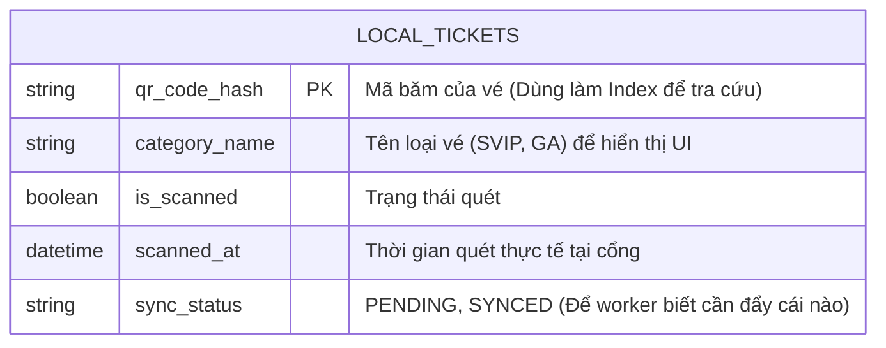
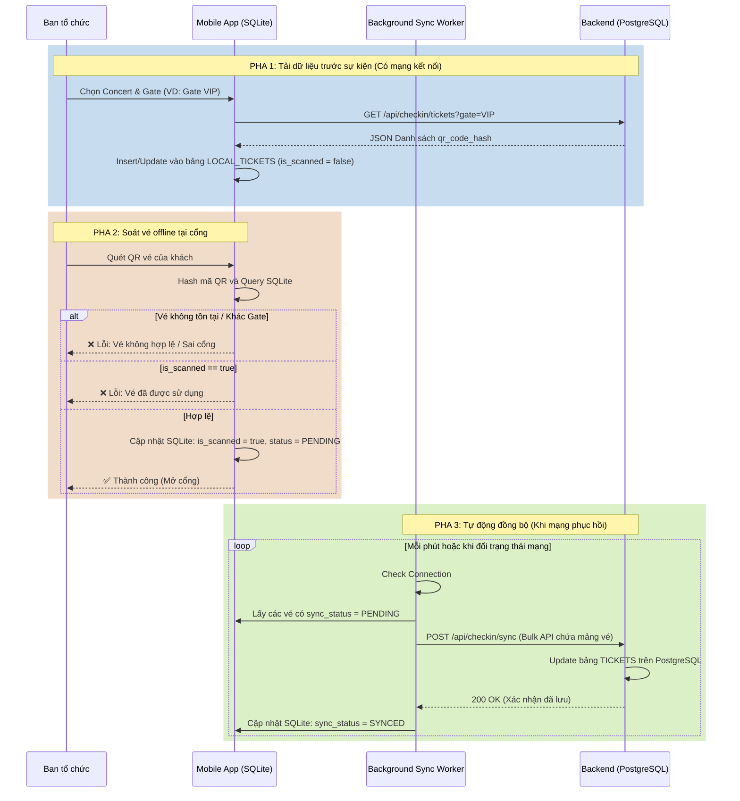

## 5. SOÁT VÉ OFFLINE TẠI SỰ KIỆN (OFFLINE CHECK-IN)

Mạng tại sân vận động thường rất yếu hoặc mất kết nối.

### Vấn đề cần giải quyết:

Ghi nhận soát vé không cần mạng, đồng bộ khi có mạng, chống quét 1 vé 2 lần.

### Đánh giá phương án & Trade-offs:

- **Quy trình:**

1. **Pre-fetch:** Buổi sáng trước sự kiện, app soát vé của nhân sự tải toàn bộ danh sách mã QR băm (hashed QR) của concert đó về database cục bộ trên điện thoại (SQLite / Room).
2. **Offline Scan:** Quét QR -> Kiểm tra trong SQLite. Nếu hợp lệ -> Đánh dấu `is_scanned = true`, lưu timestamp.
3. **Sync:** Có một Background Worker trong app liên tục ping server. Khi có mạng, tự động đẩy các bản ghi đã quét lên server qua một API bulk-update.

- **Trade-off về xung đột dữ liệu (Conflict):** Nếu 1 khán giả in 2 vé giấy, đưa cho 2 người ở 2 cổng khác nhau (cả 2 cổng đều đang mất mạng).
- _Cách giải quyết nghiệp vụ:_ Yêu cầu chia cổng (Gate 1 chỉ quét vé VIP, Gate 2 chỉ vé GA). Như vậy 1 vé không thể bị quét trùng ở 2 thiết bị khác nhau.

---

# DETAILS: CHUYÊN SÂU LUỒNG SOÁT VÉ OFFLINE (OFFLINE CHECK-IN MODULE)

Môi trường thực tế tại các sự kiện âm nhạc lớn rất khắc nghiệt đối với các hệ thống phần mềm. Các địa điểm tổ chức concert lớn (sân vận động, nhà thi đấu) thường có vùng sóng không ổn định khi hàng chục nghìn người tập trung. Việc phụ thuộc hoàn toàn vào API Server để xác thực vé sẽ dẫn đến thảm họa kẹt cứng tại cổng. Yêu cầu đặt ra là app phải cho phép ghi nhận soát vé tạm thời khi không có mạng và tự đồng bộ lại khi kết nối được phục hồi. Đồng thời, hệ thống phải đảm bảo dữ liệu không được mất khi kết nối trở lại và không được cho phép một vé vào cổng hai lần.

## A. BÀI TOÁN 1: LƯU TRỮ VÀ XÁC THỰC TẠI CHỖ (LOCAL VERIFICATION)

Thay vì gọi API qua mạng 4G chập chờn, chúng ta sẽ biến mỗi chiếc điện thoại của nhân sự kiểm soát thành một "Server thu nhỏ".

### 1. Giải pháp lưu trữ (Local Storage)

- **Công nghệ:** Sử dụng SQLite trên thiết bị di động (thông qua thư viện Room cho Android hoặc CoreData cho iOS). SQLite cực kỳ nhẹ và có tốc độ truy vấn (Read) tính bằng micro-giây, hoàn toàn đáp ứng được tốc độ quét liên tục (dưới 1 giây/vé) tại cổng.

- **Bảo mật:** Không tải xuống thông tin cá nhân của người dùng (Tên, Email) để tránh lộ lọt dữ liệu nếu thiết bị bị mất. Chỉ tải về danh sách mã QR băm (hashed QR) của concert đó. Khi quét QR trên vé giấy/điện thoại, app tự băm chuỗi nội dung đó và dò tìm trong SQLite.

### 2. Chiến lược Pre-fetch (Tải trước dữ liệu)

- **Quy trình:** Buổi sáng trước sự kiện (khi mạng Wifi ở nhà hoặc mạng 4G chưa bị nghẽn), nhân sự mở app, chọn Concert và bấm "Đồng bộ vé". App gọi API tải toàn bộ danh sách vé hợp lệ về database cục bộ trên điện thoại.

- **Tối ưu Pagination:** Nếu concert có 80.000 vé, không nên trả về trong 1 cục JSON khổng lồ (dễ gây Out of Memory trên điện thoại). API tải vé cần hỗ trợ phân trang (Pagination) hoặc cấp dữ liệu theo từng luồng (Stream) để ghi dần vào SQLite.

---

## B. BÀI TOÁN 2: ĐỒNG BỘ DỮ LIỆU & GIẢI QUYẾT XUNG ĐỘT (SYNC & CONFLICT RESOLUTION)

Đây là thách thức lớn nhất của module này: Dữ liệu bị phân tán trên nhiều thiết bị offline (Distributed Split-Brain).

### 1. Phân tích kịch bản xung đột (Double-spending problem)

- **Tình huống:** Nếu 1 khán giả in 2 vé giấy, đưa cho 2 người ở 2 cổng khác nhau (cả 2 cổng đều đang mất mạng).

- **Sự cố kỹ thuật:** Điện thoại A quét vé giấy số 1 -> Hợp lệ (vì điện thoại A không có mạng để biết vé này đã bị quét). Điện thoại B quét vé giấy số 2 -> Cũng hợp lệ. Khi có mạng, cả A và B đồng bộ lên server -> Server nhận 2 lệnh check-in cho cùng 1 vé. Lỗ hổng đã xảy ra.

### 2. Thiết kế được chọn: Giải quyết bằng Nghiệp vụ thay vì Kỹ thuật

Cố gắng giải quyết bài toán này thuần túy bằng kỹ thuật (như thiết lập Local Mesh Network qua Bluetooth/Wifi Direct giữa các máy) là quá phức tạp và thiếu ổn định. Thay vào đó, ta giải quyết triệt để bằng nghiệp vụ tổ chức:

- **Phân luồng vé (Gate Segregation):** Yêu cầu chia cổng (Gate 1 chỉ quét vé VIP, Gate 2 chỉ vé GA).

- **Cơ chế:** Buổi sáng, thiết bị của Gate 1 **chỉ tải về** SQLite danh sách vé VIP. Thiết bị Gate 2 **chỉ tải về** vé GA.
- **Kết quả:** Nếu kẻ gian mang bản sao vé VIP sang Gate 2, app sẽ báo "Vé không hợp lệ" do không có trong SQLite cục bộ. Nếu kẻ gian mang cả 2 vé VIP đến Gate 1, do Gate 1 thường chỉ gồm 1-2 nhân sự đứng cạnh nhau, họ dùng chung 1 thiết bị hoặc dễ dàng kết nối cục bộ, việc quét vé 2 lần sẽ bị SQLite trên thiết bị chặn lại ngay lập tức (is_scanned = true). Như vậy 1 vé không thể bị quét trùng ở 2 thiết bị khác nhau.

### 3. Chiến lược Đồng bộ (Background Sync)

- Sử dụng Background Worker (như WorkManager của Android). Có một Background Worker trong app liên tục ping server.

- Khi có mạng, tự động đẩy các bản ghi đã quét lên server qua một API bulk-update (cập nhật hàng loạt) thay vì gửi từng request một để tiết kiệm pin và băng thông.

---

## C. THIẾT KẾ CƠ SỞ DỮ LIỆU & LUỒNG XỬ LÝ (ERD & DATA FLOW)

### 1. Sơ đồ Database Cục bộ trên Mobile (SQLite / Room)

Không giống như PostgreSQL trên server lưu nhiều thông tin, bảng trong SQLite của Mobile App được thiết kế cực kỳ tối giản (phẳng hóa) để truy vấn nhanh nhất.

### 2. Sơ đồ luồng hoạt động (Sequence Diagram) - Check-in & Sync

Sơ đồ dưới đây minh họa ba pha hoạt động độc lập của app soát vé, đảm bảo hệ thống không bao giờ bị block bởi tình trạng mạng.

