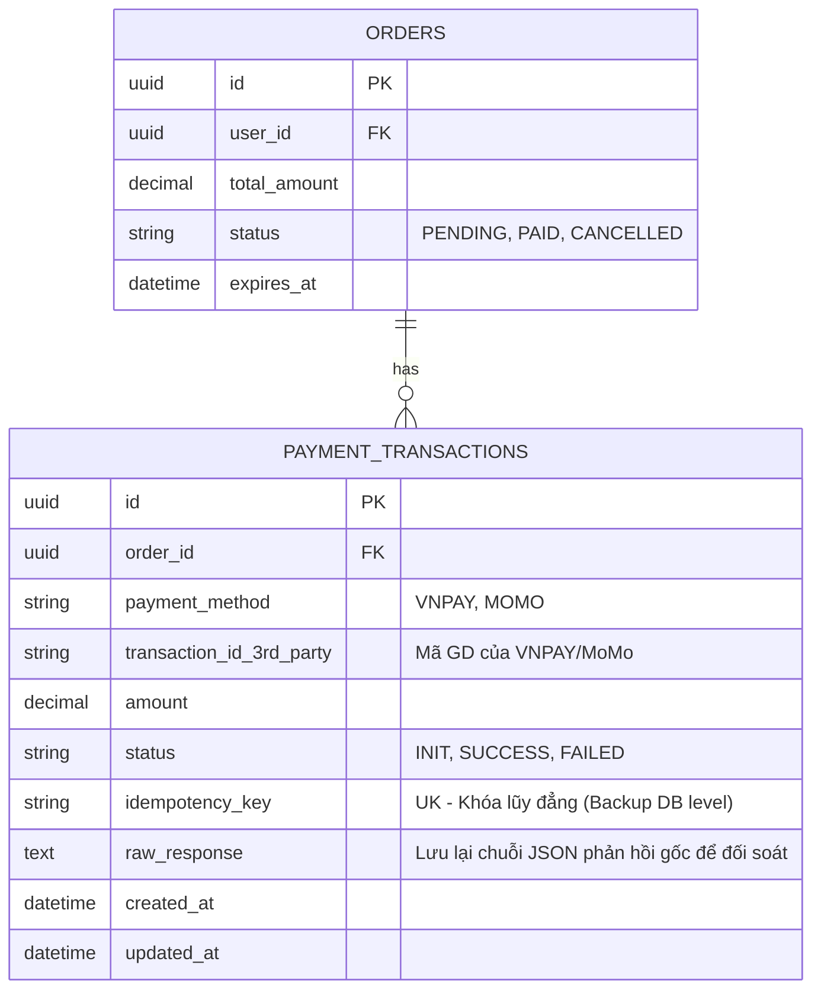
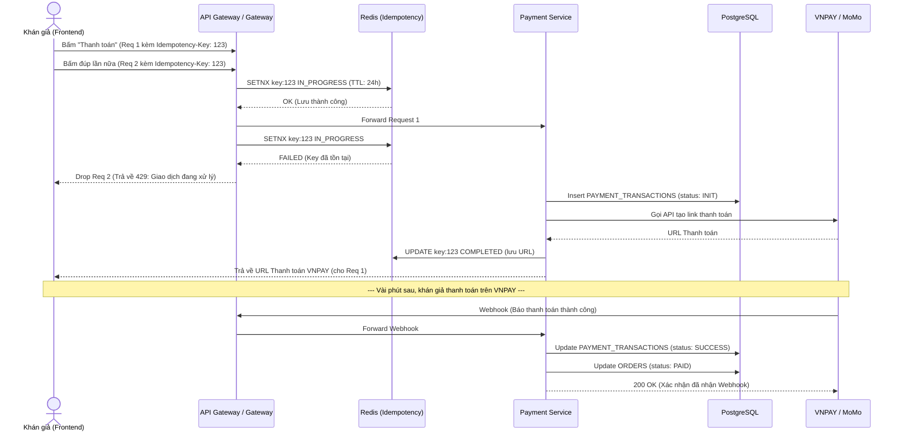

## 2. XỬ LÝ THANH TOÁN (PAYMENTS)

Luồng thanh toán tích hợp bên thứ ba (VNPAY, MoMo) thường tiềm ẩn rủi ro về độ ổn định.

### Vấn đề cần giải quyết:

1.  **Cổng thanh toán lỗi:** Không kéo sập các dịch vụ khác (xem concert, check-in).

2.  **Trừ tiền hai lần:** Do mạng rớt hoặc user bấm F5 liên tục.

### Đánh giá phương án & Trade-offs:

- **Xử lý tích hợp bên thứ ba:** Sử dụng **Circuit Breaker Pattern** (có thể dùng thư viện như Resilience4j). Nếu gọi API MoMo thất bại liên tục 50% trong 10 giây -> Chuyển Circuit Breaker sang trạng thái **Open**. Lúc này hệ thống tự động ẩn nút thanh toán MoMo (Graceful Degradation) thay vì để request treo gây tràn RAM.

- Chống trừ tiền hai lần (Idempotency):

- Mỗi khi bấm nút "Thanh toán", frontend sinh ra một mã `Idempotency-Key` (UUID) gắn vào Header.

- Backend nhận request, lưu key này vào Redis với TTL = 24h.
- Nếu user bấm F5, backend thấy key đã tồn tại -> không tạo giao dịch mới mà trả về kết quả của giao dịch cũ.

---

Dưới đây là phần phân tích chuyên sâu (Details) cho module **Thanh toán (Payment)**, giải quyết triệt để hai bài toán cốt lõi: Chống trừ tiền hai lần và Xử lý sự cố mạng, kèm theo sơ đồ ERD và Sequence Diagram chi tiết như bạn yêu cầu. Bạn có thể dùng nội dung này cho file `specs/payment.md`.

---

# DETAILS: CHUYÊN SÂU LUỒNG THANH TOÁN (PAYMENT MODULE)

Module này giải quyết bài toán tích hợp bên thứ 3 (VNPAY, MoMo). Yêu cầu tối thượng là hệ thống không được trừ tiền khách hàng nhiều hơn một lần cho một đơn hàng, và không bị kéo sập khi đối tác thanh toán gặp sự cố.

## A. BÀI TOÁN 1: CHỐNG TRỪ TIỀN HAI LẦN (DOUBLE CHARGING)

**Tình huống thực tế:** Khán giả bấm nút "Thanh toán", nhưng mạng bị lag. Khán giả mất kiên nhẫn bấm thêm 2-3 lần nữa, hoặc F5 trang web, dẫn đến việc gửi nhiều request thanh toán cho cùng một đơn hàng.

### 1. Phân tích các phương án (Tại sao không nên dùng)

- **Phương án 1: Vô hiệu hóa (Disable) nút bấm trên Frontend sau khi click**.

- _Cách hoạt động:_ Dùng JavaScript để chặn nút "Thanh toán" sau lần bấm đầu tiên.

- _Tại sao loại bỏ:_ Không an toàn. Nếu mạng rớt thật, request chưa tới server, user sẽ kẹt ở màn hình đó vĩnh viễn. Hơn nữa, kẻ gian có thể dùng Postman hoặc Bot gửi gọi API trực tiếp để lách qua Frontend.

- **Phương án 2: Dựa vào Unique Constraint (Khóa độc nhất) của Database**.

- _Cách hoạt động:_ Đặt trường `order_id` trong bảng Transactions là Unique.

- _Tại sao loại bỏ:_ Khi mạng chậm, request đầu tiên đến server đang xử lý dở dang (chưa kịp insert DB). Request thứ hai bay tới sẽ không bị DB chặn lại (do DB chưa có dữ liệu). Hậu quả là sinh ra race condition và lọt qua cả 2 giao dịch.

### 2. Thiết kế được chọn: Idempotency Key Pattern (Tính lũy đẳng)

Idempotency đảm bảo rằng một thao tác, dù được thực hiện một hay nhiều lần, vẫn cho ra cùng một kết quả mà không gây ra tác dụng phụ (trừ tiền nhiều lần).

**Cơ chế hoạt động chi tiết ở tầng thấp:**

- **Cơ chế sinh key:** Ngay khi khán giả vào màn hình thanh toán, Frontend tự động sinh ra một mã `Idempotency-Key` (thường là chuẩn UUID v4).

- **Gắn vào Request:** Frontend đính kèm mã này vào Header của HTTP Request (VD: `Idempotency-Key: 123e4567-e89b-12d3...`).

- **Nơi lưu trữ và Kiểm tra trùng lặp (Server-side):**

1. Backend nhận request, lập tức gọi vào Redis kiểm tra key này.

2. _Nếu Key chưa tồn tại:_ Redis lưu Key lại với trạng thái `IN_PROGRESS`. Backend tiến hành gọi API VNPAY/MoMo. Khi có kết quả, cập nhật trạng thái Key thành `COMPLETED` (kèm dữ liệu phản hồi).

3. _Nếu Key đã tồn tại (khán giả bấm F5 hoặc bấm đúp):_ Backend lập tức chặn request lại. Nó lấy kết quả giao dịch cũ từ Redis (hoặc báo lỗi "Giao dịch đang xử lý") và trả về cho Frontend mà không gọi lại API thanh toán.

- **Thời gian hết hạn (TTL):** Lưu trong Redis với TTL là 24 giờ. Đủ dài để chống bấm đúp, và sẽ tự động dọn dẹp để tiết kiệm RAM.

---

## B. BÀI TOÁN 2: CỔNG THANH TOÁN KHÔNG ỔN ĐỊNH

**Tình huống thực tế:** Ngày mở bán, không chỉ TicketBox tải cao mà chính hệ thống của VNPAY hoặc MoMo cũng có thể bị quá tải và phản hồi rất chậm (timeout).

### 1. Phân tích sự sụp đổ dây chuyền (Cascading Failure)

Nếu VNPAY bị nghẽn và phản hồi mất 30 giây. Hàng nghìn request thanh toán của TicketBox sẽ bị treo trong 30 giây đó. Các Thread (luồng xử lý) của Backend sẽ bị giữ lại. Cạn kiệt Thread Pool khiến toàn bộ TicketBox sập hoàn toàn — khán giả không thanh toán được mà những khán giả khác muốn vào xem thông tin concert cũng không được (dù luồng xem concert không liên quan đến thanh toán).

### 2. Thiết kế được chọn: Circuit Breaker Pattern (Cầu dao tự ngắt)

Mô hình này hoạt động y hệt cầu dao điện trong nhà bạn, cắt điện khi đoản mạch để bảo vệ các thiết bị khác.

**Cơ chế hoạt động với 3 trạng thái (State Machine):**

- **Trạng thái CLOSED (Đóng mạch - Hoạt động bình thường):** Các request gửi sang VNPAY/MoMo trôi chảy. Hệ thống âm thầm ghi nhận tỷ lệ lỗi (Error Rate).

- **Trạng thái OPEN (Ngắt mạch - Có sự cố):** \* _Điều kiện kích hoạt:_ Nếu API VNPAY/MoMo timeout liên tục (ví dụ: lỗi > 50% trong vòng 10 giây). Cầu dao "sập".

- _Xử lý:_ Toàn bộ request tiếp theo gọi VNPAY sẽ bị Backend TicketBox từ chối ngay lập tức (Fast-fail) mà không cần chờ gửi mạng. Các Thread được giải phóng tức thì, cứu toàn bộ hệ thống không bị treo.

- _Graceful Degradation (Suy giảm nhẹ):_ Frontend nhận lỗi từ Backend, tự động ẩn nút thanh toán qua VNPAY, hiển thị thông báo: "Cổng VNPAY đang bảo trì, vui lòng dùng MoMo".

- **Trạng thái HALF-OPEN (Mở hé - Thử nghiệm phục hồi):**

- Sau một khoảng thời gian chờ (ví dụ 60 giây), cầu dao tự hé mở. Nó cho phép một số lượng request rất nhỏ (ví dụ 5 request) đi qua để "thăm dò".

- Nếu 5 request này thành công, cổng VNPAY đã ổn định, mạch chuyển về `CLOSED`. Nếu vẫn lỗi, mạch bật lại `OPEN` và tiếp tục chờ thêm 60 giây nữa.

---

## C. THIẾT KẾ CƠ SỞ DỮ LIỆU & LUỒNG XỬ LÝ (ERD & DATA FLOW)

Để hiện thực hóa tính năng chống trừ tiền 2 lần và lưu vết lịch sử thanh toán, chúng ta cần mở rộng ERD từ phần View & Buy Tickets và thêm bảng ghi nhận giao dịch.

### 1. Sơ đồ thực thể liên kết (ERD) - Payment Module

**Ý đồ thiết kế bảng `PAYMENT_TRANSACTIONS`:**

- **Tách biệt với bảng `ORDERS`:** Một đơn hàng (`ORDERS`) có thể có nhiều lần thử thanh toán (ví dụ: thanh toán MoMo báo số dư không đủ -> thử lại bằng VNPAY). Do đó quan hệ là 1 - N.
- **`idempotency_key` (Unique Key):** Dù đã chặn trùng lặp ở Redis (tầng cache), ta vẫn thiết lập Unique Constraint cho trường này ở database làm "chốt chặn cuối cùng" (Defense in depth) đề phòng Redis bị sập hoặc mất dữ liệu.
- **`raw_response` (text):** Rất quan trọng trong hệ thống tài chính. Cần lưu lại nguyên văn JSON/XML mà VNPAY/MoMo trả về để kế toán đối soát (reconciliation) nếu có tranh chấp khiếu nại (khách kêu đã trừ tiền nhưng hệ thống báo lỗi).

### 2. Sơ đồ luồng hoạt động (Sequence Diagram) - Chống trừ tiền 2 lần

Sơ đồ dưới đây mô tả chính xác cách hệ thống xử lý khi khán giả lỡ bấm đúp nút thanh toán (gửi 2 request cùng lúc).

