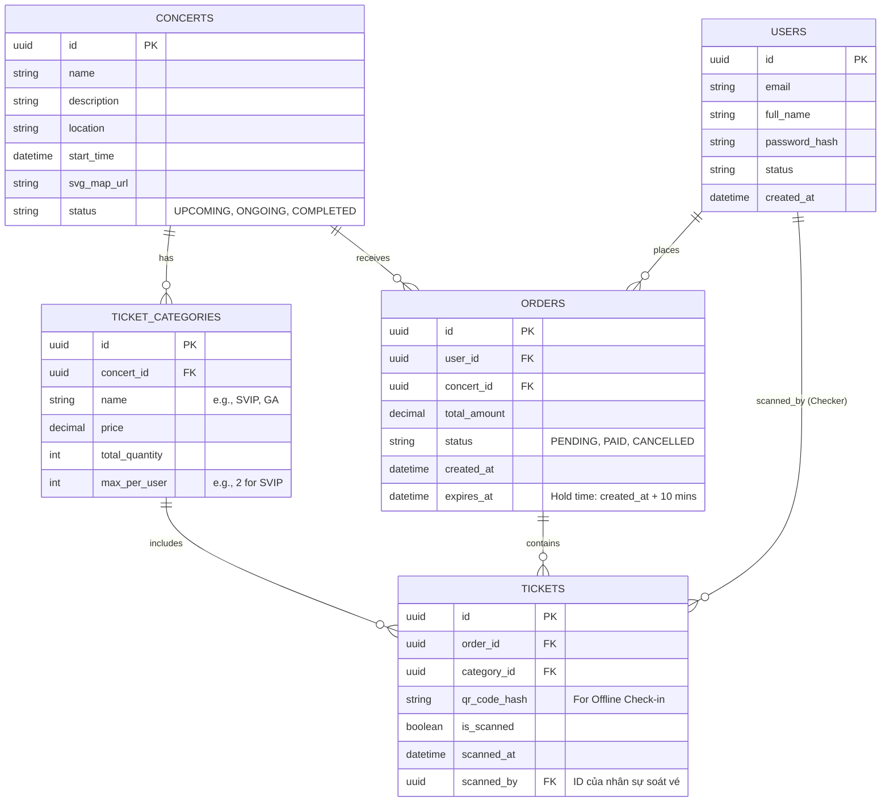

# 1. XEM VÀ MUA VÉ (VIEW & BUY TICKETS)

Đây là luồng quan trọng nhất và chịu tải cao nhất của hệ thống.

## Vấn đề cần giải quyết:

1. **Trang chủ và trang chi tiết bị quá tải:** Hàng nghìn request/giây đọc dữ liệu ít thay đổi.
2. **Tranh chấp vé (Concurrency):** Đảm bảo không có 2 người mua cùng 1 vé cuối cùng.
3. **Giới hạn vé per-user:** Kiểm soát số vé tối đa mỗi tài khoản được mua dưới tải cao.

## Đánh giá phương án & Trade-offs:

**A. Giải quyết Tải trọng đọc (Read Heavy):**

* **Phương án 1 (Truy vấn thẳng DB):** Rất dễ code nhưng sẽ sập ngay giây đầu tiên.
* **Phương án 2 (Cache-aside với Redis):** Cache thông tin concert và số lượng vé.
* *Trade-off:* Số lượng vé trong Redis có thể bị "lag" so với thực tế (Eventual Consistency).
* *Đề xuất:* Dùng Redis. Thông tin concert (tên, giá, SVG) set TTL dài (vài giờ). Số vé còn lại set TTL ngắn (vài giây) hoặc cập nhật chủ động (Write-through) mỗi khi có vé thanh toán thành công. Các file tĩnh (Sơ đồ SVG, hình ảnh) đẩy lên CDN.

**B. Giải quyết Tranh chấp vé & Giới hạn per-user:**

* **Phương án 1 (Pessimistic Locking trong SQL - `SELECT FOR UPDATE`):** Đảm bảo chính xác 100% dữ liệu. *Trade-off:* Gây lock database, thắt cổ chai toàn hệ thống, database sẽ sập khi có 80.000 người truy cập.
* **Phương án 2 (Optimistic Locking):** Dùng versioning. *Trade-off:* Sẽ có hàng chục nghìn request bị từ chối và trả về lỗi, trải nghiệm người dùng (UX) rất tệ.
* **Phương án 3 (Redis + Lua Script + Message Queue):** (Khuyên dùng)
* Sử dụng **Lua Script** trong Redis để thực hiện nguyên tử (atomic) 3 việc cùng lúc: Kiểm tra giới hạn vé của user -> Kiểm tra vé còn trống -> Trừ số lượng vé trống & Tăng số vé user đã mua.
* Nếu Redis trả về OK, đẩy request vào Message Queue (RabbitMQ) và báo cho user "Đang xử lý/Đang giữ chỗ".
* Worker đọc Queue và insert vào PostgreSQL (đảm bảo DB chỉ ghi với tốc độ ổn định, không bị nghẽn).

---

# DETAILS: CHUYÊN SÂU LUỒNG XEM VÀ MUA VÉ

Luồng này phải giải quyết hai bài toán hoàn toàn trái ngược nhau: **Đọc cực nhiều** (Trang chủ, chi tiết) và **Ghi có tranh chấp cao** (Mua vé).

## A. BÀI TOÁN 1: TẢI TRỌNG ĐỌC ĐỘT BIẾN (READ-HEAVY)

Khi concert Chị Đẹp Đạp Gió Rẽ Sóng mở bán, dự kiến có 80.000 người truy cập trong 5 phút đầu. Phần lớn request dồn vào API lấy thông tin concert, sơ đồ SVG và số lượng vé.

### 1. Phân tích sự sụp đổ nếu dùng Database (PostgreSQL) trực tiếp:

* **Vấn đề Connection Pool:** Cấu hình mặc định của PostgreSQL thường chỉ chịu được khoảng vài trăm đến 1.000 connection đồng thời. Nếu 80.000 người gọi API cùng lúc, database sẽ cạn kiệt connection (Connection Pool Exhaustion).
* **Vấn đề I/O (Input/Output):** Ổ cứng (dù là SSD) khi phải scan bảng Concerts và Tickets hàng chục nghìn lần mỗi giây sẽ đạt giới hạn IOPS (Input/Output Operations Per Second), dẫn đến timeout toàn hệ thống.

### 2. Thiết kế Chiến lược Multi-Layer Caching:

Thay vì để request chạm tới DB, ta sẽ chặn nó lại bằng nhiều lớp khiên.

* **Lớp 1: CDN (Content Delivery Network)**
* **Áp dụng cho:** Các file tĩnh không thay đổi như Hình ảnh nghệ sĩ, CSS, JS, và đặc biệt là **Sơ đồ chỗ ngồi SVG**.
* **Lý do:** Giảm tải băng thông (bandwidth) cho server gốc. CDN lưu file ở các edge server gần người dùng nhất. Sơ đồ SVG rất nặng, nếu server tự serve sẽ sập băng thông mạng.
* **Lớp 2: Redis Caching (Memory)**
* **Áp dụng cho:** Thông tin Concert (Tên, Giá, Mô tả) và Số lượng vé còn lại.
* **Chiến lược cho Thông tin Concert (Dữ liệu tĩnh):** Dùng **Cache-Aside**. TTL (Time To Live) set dài (ví dụ: 24 giờ). Nếu Admin sửa thông tin, gọi API Invalidate cache.
* **Chiến lược cho Số vé còn lại (Dữ liệu động):** Đây là phần khó nhất. Không thể dùng Cache-Aside thông thường vì sẽ bị "stale data" (dữ liệu cũ).
* **Giải pháp:** Tách riêng API `/api/concerts/{id}` (ít đổi) và API `/api/concerts/{id}/tickets/available` (đổi liên tục). Số vé còn lại sẽ lấy trực tiếp từ một biến Counter trong Redis, biến này được tăng/giảm realtime mỗi khi có luồng giữ vé thành công.

---

## B. BÀI TOÁN 2: TRANH CHẤP VÉ & GIỚI HẠN PER-USER (HIGH-CONCURRENCY WRITE)

Ví dụ: Có 200 vé SVIP, nhưng có 80.000 người tranh nhau mua. Mỗi người lại chỉ được mua tối đa 2 vé/tài khoản.

### 1. Tại sao các cơ chế Locking của SQL thất bại?

* **Pessimistic Locking (`SELECT ... FOR UPDATE`):**
* *Cơ chế:* Khóa hẳn dòng dữ liệu vé SVIP lại. Người thứ 1 đang mua thì 79.999 người còn lại phải đợi.
* *Tại sao loại bỏ:* Gây hiện tượng "Thắt cổ chai" (Bottleneck) cực kỳ nghiêm trọng. Database sẽ treo cứng vì phải giữ hàng nghìn lock trên RAM chờ xử lý. Tốc độ ghi rớt thảm hại.
* **Optimistic Locking (Versioning):**
* *Cơ chế:* Không khóa. Cứ cho đọc. Khi ghi xuống kiểm tra xem `version` có khớp không.
* *Tại sao loại bỏ:* 80.000 người cùng đọc thấy còn 200 vé (version 1). Nhưng chỉ 200 người đầu tiên ghi thành công (version 2). 79.800 người còn lại sẽ bị văng lỗi (Conflict) và phải tự bấm F5 liên tục. Trải nghiệm người dùng (UX) là thảm họa.

### 2. Thiết kế được chọn: Redis (Single-Thread) + Lua Script + Message Broker

Đây là pattern kinh điển: "Biến xử lý đồng thời (Concurrent) thành xử lý tuần tự (Sequential) trên bộ nhớ ảo".

**Quyết định kỹ thuật (ADR) chi tiết:**

* **Tại sao là Redis?** Redis chạy trên RAM và xử lý lệnh theo cơ chế **Single-Threaded** (chạy đơn luồng). Nghĩa là 80.000 request đến cùng lúc, Redis sẽ tự động xếp hàng chúng lại và xử lý từng cái một với tốc độ cực nhanh (micro-giây). Không bao giờ có chuyện 2 request trừ vé cùng một tích tắc.
* **Tại sao phải dùng Lua Script?** Hệ thống cần kiểm tra 3 điều kiện: (1) Ticket còn không? -> (2) User này đã mua bao nhiêu vé rồi? -> (3) Trừ vé trống và tăng vé user. Nếu gọi 3 lệnh Redis tách biệt, ở giữa các lệnh có thể xảy ra race condition. Lua Script được Redis thực thi dưới dạng **nguyên tử (Atomic)** — nó chạy trọn vẹn kịch bản này mà không bị bất kỳ request nào khác xen vào.
* **Tại sao phải dùng Message Broker (RabbitMQ/Kafka)?** Sau khi Redis trừ vé thành công (trên RAM), ta không gọi Insert thẳng vào PostgreSQL ngay lập tức. Ta đẩy request đó vào RabbitMQ. RabbitMQ hoạt động như một "hồ chứa" (Load Leveling / Shock Absorber). Postgres cứ thong thả đọc từ Queue để ghi xuống đĩa cứng với tốc độ an toàn (ví dụ: 1000 record/giây) mà không sợ chết.

### 3. Trạng thái giữ chỗ (Ticket Hold Lifecycle) - Kịch bản thực tế

Khi user được Redis cho phép mua vé, vé đó chuyển sang trạng thái **"Đang giữ" (Locked/Pending)**, user có 10 phút để thanh toán (VNPAY/MoMo).

* **Happy Case:** User thanh toán thành công. Dịch vụ Payment báo về. Worker cập nhật trạng thái đơn hàng thành "Paid". Vé chính thức là của user.
* **Edge Case (Quá thời hạn):** Nếu 10 phút user không thanh toán hoặc tắt app. Ta phải **Release** (Nhả) vé ra cho người khác mua.
* *Giải pháp:* Khi giữ vé, ta push một tin nhắn "Hủy đơn" vào **Delay Queue / Dead Letter Exchange (DLX)** của RabbitMQ với độ trễ đúng 10 phút. Sau 10 phút, tin nhắn tự động bật ra, worker kiểm tra DB: Nếu đơn hàng vẫn ở trạng thái "Pending", worker đổi thành "Cancelled" và cộng trả lại số lượng vé vào Redis.

---

**Tổng kết luồng (Kịch bản mua vé):**

1. User bấm "Mua vé" -> Gửi request.
2. API Gateway chặn lại nếu gửi quá nhiều (Rate Limit).
3. Backend gọi Lua Script vào Redis: Check limit cá nhân & số lượng tồn -> Báo OK.
4. Backend đẩy message "User A mua 2 vé SVIP" vào RabbitMQ.
5. Backend phản hồi về Client: "Đang xếp hàng / Đang xử lý". Client dùng WebSocket hoặc Polling để chờ.
6. Worker ở background nhặt message từ RabbitMQ -> Insert Order trạng thái `PENDING` vào PostgreSQL.
7. Trả kết quả cho Client chuyển sang màn hình Thanh toán.

## C. THIẾT KẾ CƠ SỞ DỮ LIỆU (DATABASE SCHEMA & ERD)

Với đặc thù của hệ thống TicketBox (cần tính nhất quán dữ liệu tuyệt đối cho các giao dịch tài chính và vé), **PostgreSQL** (Relational Database) là sự lựa chọn tối ưu nhờ hỗ trợ tốt ACID transaction.

### 1. Sơ đồ thực thể liên kết (ERD)

### 2. Đặc tả chi tiết các Bảng (Tables) và Ý đồ thiết kế (Design Decisions)

#### Bảng `TICKET_CATEGORIES` (Loại vé)

Bảng này lưu cấu hình của ban tổ chức đối với từng loại vé trong một concert.

* **`total_quantity` (int):** Tổng số vé bán ra.
* **`max_per_user` (int):** Giới hạn số vé mỗi người được mua (Ví dụ: đề bài yêu cầu SVIP tối đa 2 vé, CAT1 tối đa 4 vé).
* **💡 Trade-off Design:** Bạn sẽ thấy **không có cột `available_quantity` (số vé còn lại)** ở đây.
* *Lý do:* Nếu để DB quản lý số vé còn lại, mỗi lần mua vé ta phải chạy lệnh `UPDATE ... SET available = available - 1`, gây ra lock row và thắt cổ chai như đã phân tích. Thay vào đó, `available_quantity` được **đẩy lên sống hoàn toàn trên Redis**. DB chỉ đóng vai trò lưu trữ cấu hình gốc ban đầu.

#### Bảng `ORDERS` (Đơn hàng / Phiên giữ chỗ)

Bảng này đóng vai trò sống còn trong **Ticket Hold Lifecycle** (Vòng đời giữ chỗ).

* **`status` (enum):** `PENDING` (Đang giữ chỗ chờ thanh toán), `PAID` (Đã thanh toán), `CANCELLED` (Hết hạn 10 phút hoặc thanh toán lỗi).
* **`expires_at` (datetime):** Cột này kết hợp với Delay Queue (RabbitMQ). Nếu thời gian hiện tại vượt qua `expires_at` mà status vẫn là `PENDING`, Worker sẽ tự động chuyển thành `CANCELLED` và báo cho Redis cộng trả lại vé.

#### Bảng `TICKETS` (Chi tiết từng vé)

Bảng này chính là kho e-ticket của khán giả. Nếu một user mua 2 vé SVIP, sẽ có 1 `ORDER` được tạo ra, và 2 dòng `TICKETS` được tạo ra liên kết với Order đó.

* **`qr_code_hash` (string):** Chỉ sinh ra khi `ORDER` chuyển sang trạng thái `PAID`. Dùng hàm băm (như SHA-256) mã hóa chuỗi data để tạo QR. Không lưu bản rõ (plain text) để chống việc giả mạo mã QR.
* **`is_scanned` (boolean):** Chuẩn bị sẵn cho module **Soát vé Offline (Check-in)**. Mặc định là `false`, khi nhân viên soát vé quét ở cổng sẽ thành `true`.
* **`scanned_at` (datetime):** Thời gian thực tế khi vé được quét tại cổng.
* **`scanned_by` (uuid, FK):** ID của nhân sự soát vé (Checker) thực hiện quét vé để lưu vết kiểm toán (Audit).

---

### 3. Mapping giữa Database và Luồng xử lý (Data Flow)

Để bạn dễ hình dung sự liên kết giữa phần chữ (Logic) và Database ở trên, kịch bản dữ liệu sẽ chạy như sau:

1. **Chuẩn bị mở bán:** Admin tạo Concert. Backend query PostgreSQL lấy `total_quantity` và `max_per_user` của bảng `TICKET_CATEGORIES`, đẩy lên cấu hình trong **Redis**.
2. **Khán giả bấm mua 2 vé SVIP:**

* Redis chạy Lua script trừ đi 2 vé thành công.
* RabbitMQ nhận message.
* Background Worker đọc message, Insert 1 dòng vào bảng `ORDERS` (status = `PENDING`, expires_at = now + 10 mins).

3. **Thanh toán thành công:**

* Webhook từ VNPAY gọi về.
* Backend Update bảng `ORDERS` thành status = `PAID`.
* Backend Insert 2 dòng vào bảng `TICKETS` kèm theo 2 mã `qr_code_hash`.
* Trigger Notification Service gửi Email kèm QR code cho user.